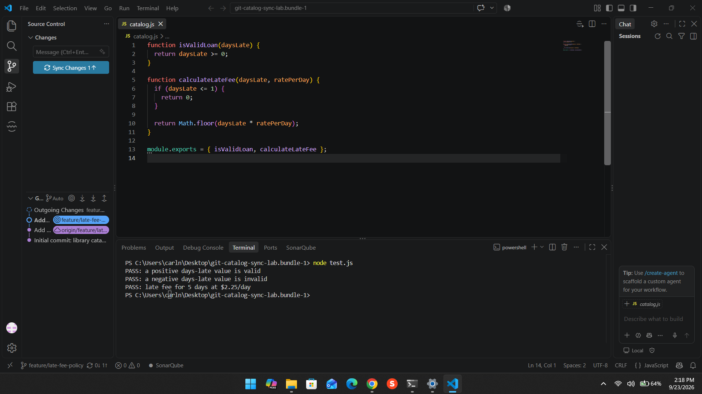
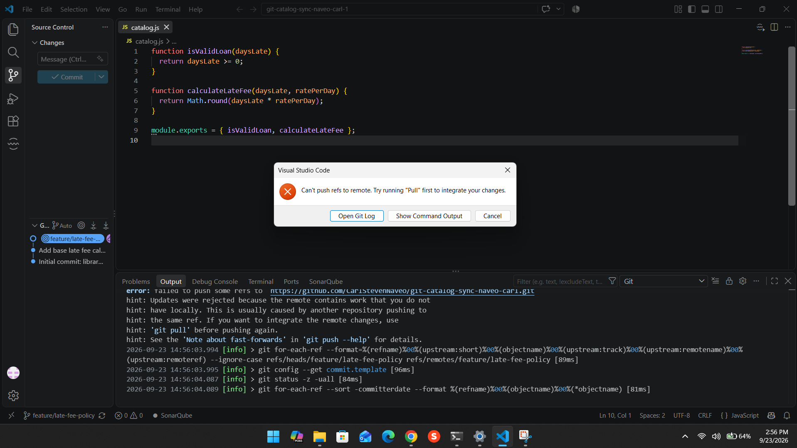
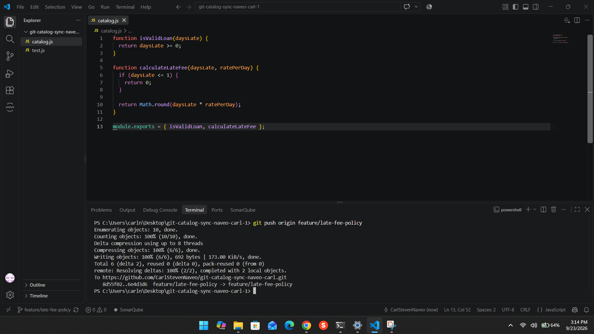
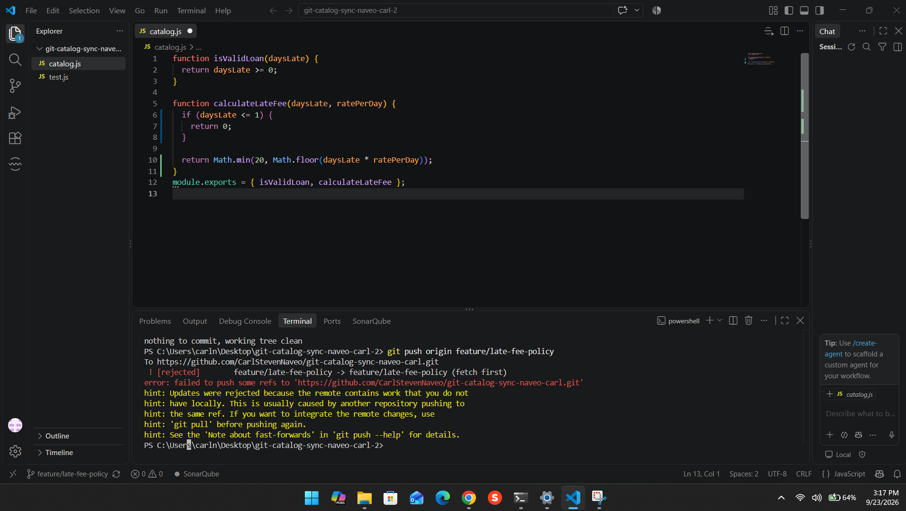
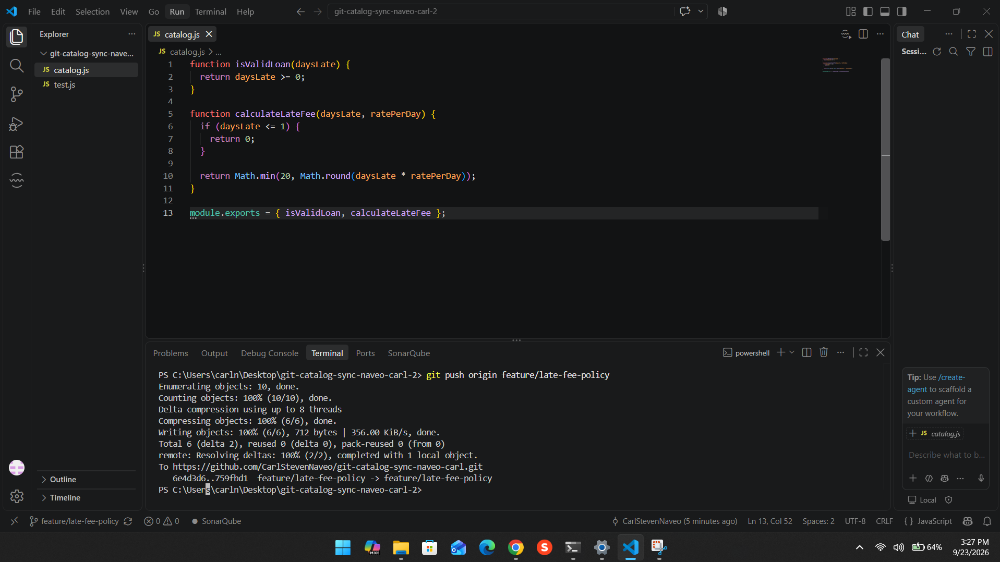
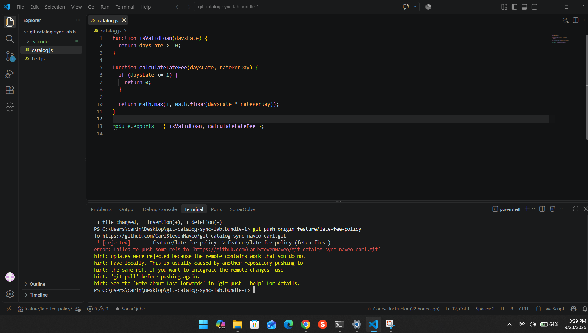
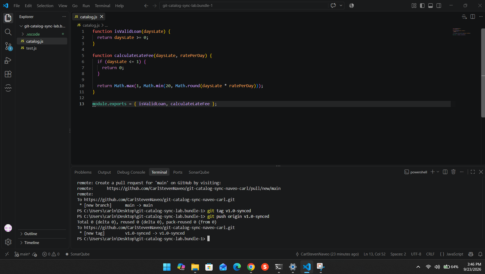

# Git Synchronization Workflow

## Task 1 – Grace Period

Clone A added a 1-day grace period to the late fee calculation. If the number of days late is 1 or less, the fee is $0.



## Task 2 – Rounding

Clone B changed the late fee calculation from `Math.floor()` to `Math.round()`. The push was rejected because Clone B did not have the latest remote changes.



## Task 3 – Merge Conflict

Clone B fetched the latest changes and merged the grace-period change from Clone A with its rounding change. The conflict was resolved so both changes remained in the final calculation.



## Task 4 – Maximum Fee Cap

Clone C added a $20 maximum late fee cap. Its push was rejected because the remote branch already contained newer work.



## Task 5 – Three-Way Merge

Clone C fetched the latest changes and merged its $20 cap with the grace period and rounding changes. The conflict was resolved so all three changes were preserved.



## Task 6 – Rebase and Minimum Fee

Clone A, which had not fetched since Task 1, added a $1 minimum fee. The first push was rejected because the remote branch had newer changes.

Clone A then fetched the latest remote history and rebased its change onto it. The conflict was resolved so the final calculation preserved the grace period, rounding, $20 maximum, and $1 minimum. The rebased branch was pushed without using force.



## Task 7 – Final Merge and Tag

The completed feature branch was merged into `main`. The final `main` branch was pushed to GitHub, and the final commit was tagged `v1.0-synced`.



# Reflection Questions

## 1. Final `calculateLateFee` and contributor changes

The final `calculateLateFee` combines the changes made by the contributors:

- **1-day grace period:** Clone A, Task 1. Days late of 1 or less results in a $0 fee.
- **Rounding:** Clone B, Task 2. `Math.round()` is used instead of `Math.floor()`.
- **$20 maximum fee:** Clone C, Task 4. `Math.min(20, ...)` limits the fee to $20.
- **$1 minimum fee:** Clone A, Task 6. `Math.max(1, ...)` makes the minimum non-zero fee $1.

The final calculation applies these rules together.

## 2. Task 3 Two-Way Conflict vs. Task 5 Three-Way Conflict

The Task 3 conflict involved two lines of development: the grace-period change from Clone A and the rounding change from Clone B.

Task 5 was more difficult because a third line of development had been added. Clone C had its own $20 cap while the remote branch already contained the grace-period and rounding changes. The conflict required combining three separate changes without removing any of their intended behavior.

## 3. Task 5 Merge vs. Task 6 Rebase

In Task 5, the merge combined two histories and created a merge commit. The original commits remained in their existing history.

In Task 6, rebase took the local minimum-fee commit and replayed it on top of the newer remote history. This produced a new commit ID and created a more linear history.

The main difference is that **merge combines histories**, while **rebase moves and reapplies commits onto a new base**.

## 4. Process Change That Could Prevent the Rejected Pushes

One process change would be to require each contributor to fetch the latest remote changes before pushing their work.

A simple team rule could be:

> Before pushing a task, always fetch the latest remote branch and integrate the newest changes using the agreed workflow.

This would make contributors aware of newer commits before attempting to push and would reduce avoidable rejected pushes.

# Final `calculateLateFee`

```javascript
function calculateLateFee(daysLate, ratePerDay) {
  if (daysLate <= 1) {
    return 0;
  }

  return Math.max(1, Math.min(20, Math.round(daysLate * ratePerDay)));
}
```